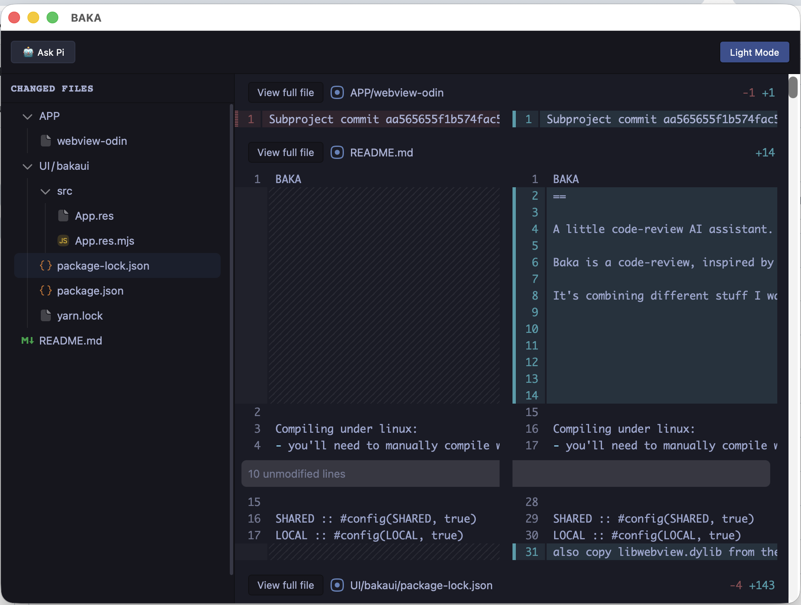
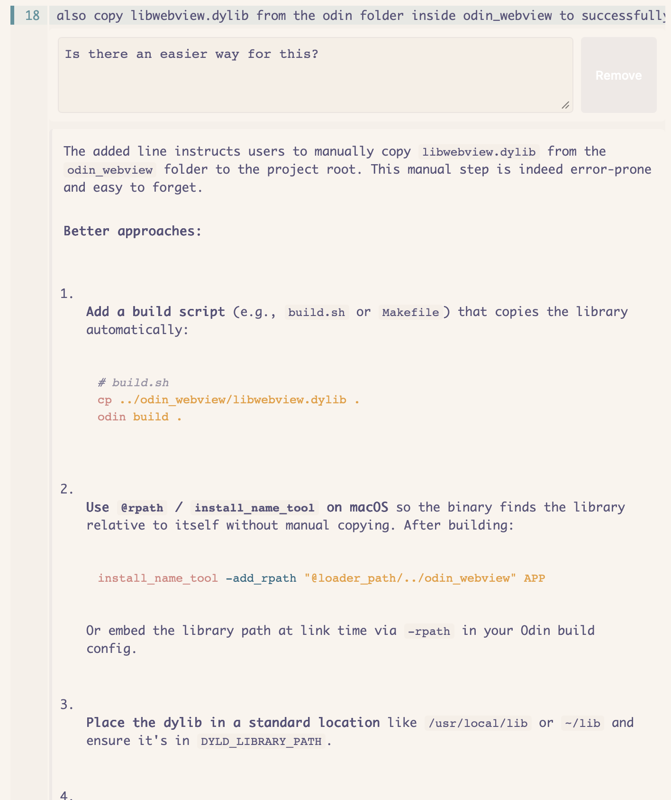
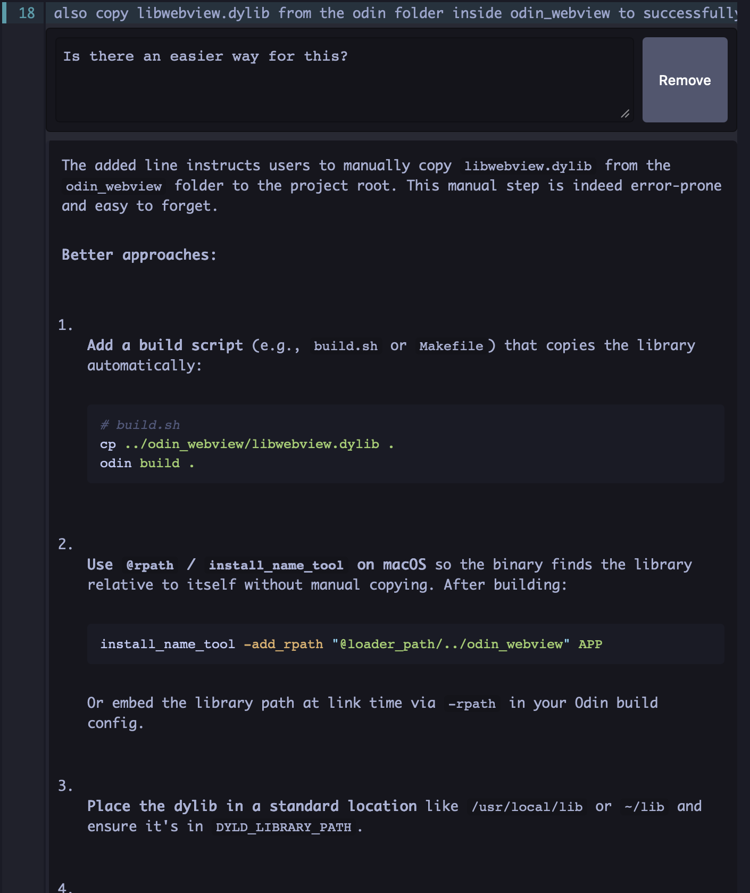

# BAKA

BAKA is a native code review application for local Git changes. It is inspired
by [Codiff](https://github.com/nkzw-tech/codiff) and uses
[Pi](https://pi.dev) for AI-assisted workflows.

The application displays the current working tree as an interactive diff. You
can comment on individual lines, ask Pi about those comments, run broader code,
security, or specification reviews, and apply suggested fixes.

BAKA also includes a project file browser, line-level commit selection, and a
feature workflow where Pi creates an implementation plan before applying it.
Repository changes are watched and the diff refreshes automatically.

Pi models can be configured independently for each action. A default model is
used unless an action has an override. Separate models can be selected for
inline questions, code review, security review, specification checking,
suggestion implementation and validation, plan creation, and plan
implementation. This makes it possible to use specialized models or reduce
costs for simpler tasks. The active model is shown in the bottom-right status
area.

Model discovery uses Pi's RPC interface, so BAKA supports the providers and
custom models configured in Pi, including local OpenAI-compatible services.

## Screenshots







## Building

BAKA requires Odin, CMake, Yarn, Pi, and the platform dependencies needed by
the webview and osdialog libraries. On Linux, install the GTK and WebKitGTK
development packages before building.

Build the UI, webview library, and native application from the repository root:

```sh
make
```

Build output is stored under `build/`.

Create the macOS application bundle:

```sh
make package
```

On macOS this writes `build/dist/BAKA.app`. The explicit target is also
available as `make macos-app` or `make osx-app`. The `make package` command is
reserved for the future Linux AppImage target on Linux.

Run BAKA against the current directory or a specific repository:

```sh
make run
make run ARGS='/path/to/repository'
make run ARGS='--verbose /path/to/repository'
```

When BAKA is launched as a desktop app, use **Open Repository** to choose the
Git working folder to review.

## Third-party acknowledgements

[`@pierre/diffs`](https://github.com/pierrecomputer/pierre/tree/main/packages/diffs)
and [`@pierre/trees`](https://github.com/pierrecomputer/pierre/tree/main/packages/trees)
provide the diff and file-tree interfaces. Both are licensed under the
[Apache License 2.0](https://www.apache.org/licenses/LICENSE-2.0).

[`Ioskeley Mono`](https://github.com/ahatem/IoskeleyMono) is embedded as the
interface font. Its license is included at
[`UI/bakaui/assets/fonts/IoskeleyMono/LICENSE`](UI/bakaui/assets/fonts/IoskeleyMono/LICENSE).
